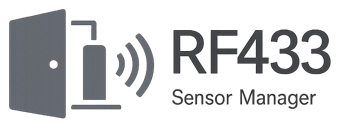

# RF433 Sensor Manager

  

A UI-configured Home Assistant custom integration that converts raw RF433 messages arriving through Home Assistant's MQTT integration into native devices and entities. MQTT is transport only; decoded state is never republished.

## Features

- One bridge and MQTT subscription per config entry, with multiple bridges supported
- JSON (simple dotted path) and plain payloads, MQTT wildcards, configurable duplicate suppression
- Built-in **DS-4 / Generic Contact Sensor** protocol (`AAAAEE`: four-character ID and two-character event)
- Reusable custom protocol profiles and exact RF-ID matching
- Manual, learn-mode, and recent-unknown-signal sensor creation
- ZHA-style live MQTT adoption that immediately lists every protocol-compatible RF device and runs until **Done**
- Door/window contact, latched low battery, native tamper event, last message, last seen, and battery-reset button
- Persistent contact/battery/history state, bounded unknown history, diagnostics, and stable device/entity identifiers
- Entirely native Home Assistant config and options flows; no YAML or custom frontend

## Installation

### HACS custom repository

1. Add this GitHub repository to HACS as an **Integration**.
2. Install **RF433 Sensor Manager** and restart Home Assistant.
3. Ensure Home Assistant's MQTT integration is configured.
4. Go to **Settings → Devices & services → Add integration** and choose RF433 Sensor Manager.

For manual installation, copy `custom_components/rf433_sensor_manager` into the same path in your Home Assistant configuration directory and restart.

## Configuration

Each entry represents one RF bridge. The setup form starts with **Tasmota Sonoff RF-bridge**, topic `tele/rf_bridge/RESULT`, JSON payloads, and path `RfReceived.Data`; every value remains editable. Setup then asks you to confirm or customize the default protocol profile before offering to scan MQTT, add sensors manually, or finish setup.

The default profile recognizes six hexadecimal characters: the first four are the exact sensor ID and the final two map `0A` open, `0E` closed, `07` tamper, and `06` low battery. These values are shown during initial setup and can be edited for another protocol. Low battery remains set until **Battery replaced** is pressed. Open/close messages never clear it.

Scan/Learn mode opens a live Home Assistant adoption view and keeps listening until **Done** is pressed. Newly discovered IDs appear immediately; each can be named and assigned to an area before it is created. Learned contact sensors start with the open/closed state of their most recent setup signal. Because RF transmissions are unauthenticated, confirm that a displayed code belongs to the intended sensor.

Diagnostics retain up to 100 distinct full RF codes per configured device ID, including unmapped event suffixes such as `01`. Each record includes its event code, recognition status, first/latest reception time, and count. Unknown-signal history is also limited to 100 distinct raw codes.

## Development

Use Python 3.14.2 or newer, install the `test` dependency group, then run `pytest`, `ruff check .`, and `mypy custom_components/rf433_sensor_manager`. GitHub Actions also runs HACS and hassfest validation.

## Privacy and limitations

Diagnostics redact configured RF identifiers. RF433 signals can be replayed and should not be treated as a security boundary. A Home Assistant restart is not needed for options changes; the entry reloads automatically.

## License

MIT
